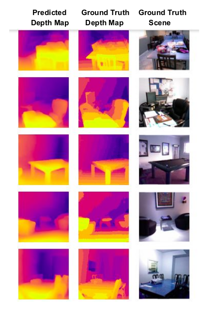

# Monocular Depth Estimation
I read the following papers and have implemented their code for NYUv2 dataset. I think this code should also work fine with KITTI dataset: [U-Net: Convolutional Networks for Biomedical Image Segmentation](https://arxiv.org/abs/1505.04597) and [High Quality Monocular Depth Estimation via Transfer Learning](https://arxiv.org/abs/1812.11941).

> This project implements the UNet Convolutional Neural Network with a ResNet encoder (pre-trained on imagenet weights) and achieved a soft-depth accuracy of 83% on the test set. Although, I've implemented it on the NYUv2 dataset, I think it should work fine on KITTI with a similar accuracy as well!

The output is demonstrated below where the left image represents the predicted depth map, the middle image represents the ground truth depth map and the right image is the ground truth scene. The color map shown in the output is "Plasma" from Matplotlib color maps. Brighter the color, the nearer the object and darker the color, the farther away is the object.




## Instructions to install environment:
- Using `anaconda`:
  - Run `conda create --name <env_name> --file depthest.yml`
  - Run `conda activate <env_name>`
- Using `pip`:
  - Run `pip install -r requirements.txt`

## Reference:
- @article{Alhashim2018,
  author    = Ibraheem Alhashim and Peter Wonka,
  title     = High Quality Monocular Depth Estimation via Transfer Learning,
  journal   = arXiv e-print,
  volume    = abs/1812.11941,
  year      = 2018,
  url       = https://arxiv.org/abs/1812.11941,
  eid       = arXiv:1812.11941,
  eprint    = 1812.11941
 }

- @inproceedings{fusenet2016accv,
 author    = "Olaf Ronneberger, Philipp Fischer, and Thomas Brox",
 title     = "U-Net: Convolutional Networks for Biomedical Image Segmentation",
 booktitle = "Medical Image Computing and Computer-Assisted Intervention – MICCAI 2015",
 year      = "2015",
 month     = "October",
}

---

# Object Detection

We also have implemented object detection using YOLOv5 [here](https://github.com/AnshMittal1811/MonocularDepthEstimation/tree/master/object_detection). The dataset used was taken from RoboFlow from [here](https://public.roboflow.com/object-detection/self-driving-car/3). This dataset consists of 15k images and is a relatively small dataset to fine-tune the weights of the YOLOv5 model. I planned to reduce the number of classes to accommodate for the MP1(b). I did this experiment on Colab and had to keep the dataset small and training as fast as possible in accordance with time. I plan to work on a W&B page for this project as well to compare different types of model.


I ran two experiments for this model by the name exp0 and exp1 but settled for results from the second one as they were significantly better given by the figure below.


You can also see the outputs for the same given below.


---

# Plan to Integrate
I was planning to integrate it in the detector and predictor files for MP1(b). But, wasn't able to do so due to limited time and as I had to leave for a flight during this time. So, I plan to integrate it later when I reach and have enough time to formulate a comparative analysis as well! Further, I planned to check my code along with these models so I had made certain changes to the simulator file that I think can be of use (so posting here): 

```python
#!/usr/bin/env python

import argparse
import csv
import logging
from collections import deque
from pathlib import Path
from typing import NamedTuple
from matplotlib import pyplot as plt
import matplotlib.animation as animation
from PIL import Image

import numpy as np
import os

from mp1_controller.controller import Controller
from mp1_distance_predictor.predictor import Predictor
from mp1_simulator.simulator import CONFIG, Observation, Simulator

logger = logging.getLogger("SIMULATION")
handler = logging.StreamHandler()
formatter = logging.Formatter("%(asctime)s %(name)-12s %(levelname)-8s %(message)s")
handler.setFormatter(formatter)
logger.addHandler(handler)
logger.setLevel(logging.INFO)


def parse_args() -> argparse.Namespace:
    parser = argparse.ArgumentParser(
        description="Mini-Project 1b: Adaptive Cruise Control in CARLA",
        formatter_class=argparse.ArgumentDefaultsHelpFormatter,
    )

    parser.add_argument(
        "--n-episodes",
        help="Number of simulations to run (defaults to 10)",
        type=int,
        default=1,
    )

    parser.add_argument(
        "--nn-model",
        help="The file where you stored your trained NN model",
        type=lambda p: Path(p).resolve(),
    )

    parser.add_argument(
        "--log-dir",
        help="Directory to store the simulation trace (defaults to 'log/' in the current directory)",
        type=lambda p: Path(p).absolute(),
        default=Path.cwd() / "logs",
    )

    parser.add_argument(
        "--seed", help="Random seed for ado behavior", type=int, default=0
    )

    parser.add_argument(
        "--render", help="Render the Pygame display", action="store_true"
    )

    return parser.parse_args()


class TraceRow(NamedTuple):
    ego_velocity: float
    target_speed: float
    distance_to_lead: float
    ado_velocity: float


def observation_to_trace_row(obs: Observation, sim: Simulator) -> TraceRow:
    row = TraceRow(
        ego_velocity=obs.velocity,
        target_speed=obs.target_velocity,
        distance_to_lead=obs.distance_to_lead,
        ado_velocity=sim._get_ado_velocity(),
    )
    return row


def run_episode(
    sim: Simulator, controller: Controller, predictor: Predictor, *, log_file: Path
):
    trace = deque()  # type: deque[TraceRow]

    obs, img = sim.reset()
    trace.append(observation_to_trace_row(obs, sim))
    PATH = r"C:\Users\acer\Semester3\Cyber Physical Systems\Assignment\images"
    while True:
        estimate_dist = predictor.predict(obs)  # here updated, was img
        print("Timestep", sim.time_step)
        action = controller.run_step(obs, estimate_dist=estimate_dist)
        obs, img = sim.step(action)

        if (sim.time_step % 5 == 0):
            im = Image.fromarray(img)
            im.save(os.path.join(PATH, f"{sim.time_step}.jpeg"))
        ## for visualizing the image ##
        plt.imshow(img, interpolation='nearest')

        plt.savefig('camera_images/vision_input.png')

        # plt.show()

        trace.append(observation_to_trace_row(obs, sim))

        if sim.completed:
            break


    with open(log_file, "w") as flog:
        csv_stream = csv.writer(flog)
        csv_stream.writerow(
            [
                "timestep",
                "time_elapsed",
                "ego_velocity",
                "target_speed",
                "distance_to_lead",
                "lead_speed",
            ]
        )

        for i, row in enumerate(trace):
            row = [
                i,
                sim.dt * i,
                row.ego_velocity,
                row.target_speed,
                row.distance_to_lead,
                row.ado_velocity,
            ]
            csv_stream.writerow(row)


def main():
    args = parse_args()
    n_episodes: int = args.n_episodes
    log_dir: Path = args.log_dir

    if log_dir.is_dir():
        logger.warning(
            "Looks like the log directory %s already exists. Existing logs may be overwritten.",
            str(log_dir),
        )
    else:
        log_dir.mkdir(parents=True, exist_ok=True)

    rng = np.random.default_rng(args.seed)

    ado_sawtooth_width = rng.uniform(low=0.2, high=0.8)
    ado_sawtooth_period = rng.uniform(low=5.0, high=15.0)

    sim = Simulator(
        render=args.render,
        ado_sawtooth_period=ado_sawtooth_period,
        ado_sawtooth_width=ado_sawtooth_width,
    )
    controller = Controller(
        distance_threshold=CONFIG["distance_threshold"],
        target_speed=CONFIG["desired_speed"],
    )

    predictor = Predictor(args.nn_model)
    predictor.initialize()

    for i in range(n_episodes):
        logger.info("Running Episode %d", i)
        episode_name = "episode-{:05d}.csv".format(i)
        run_episode(sim, controller, predictor, log_file=(log_dir / episode_name))


if __name__ == "__main__":
    main()
```
